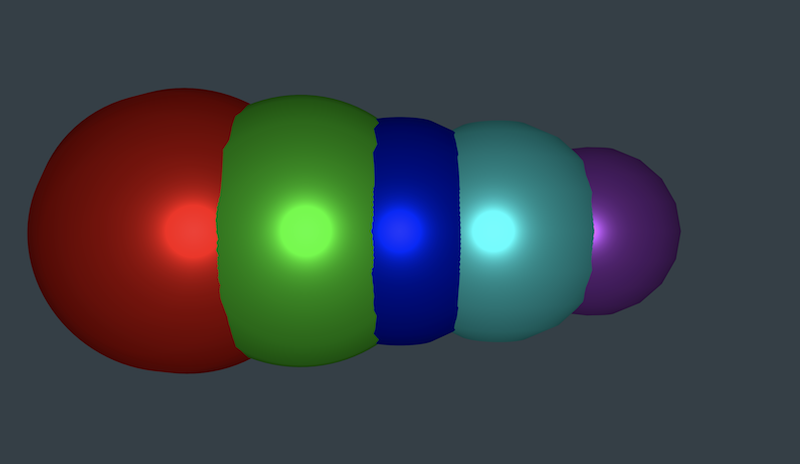

# Visualizer
This audio visualizer is a web application created with THREE.js and Web Audio API that brings your music to life. Watch as 3D shapes respond to the frequency of the music being played.

## How it Works
Visualizations are created by analyzing the waveform and frequency data of the music through the Web Audio API and then rendered in canvas with THREE.js.

## Try It
This application is [hosted on Heroku](https://visualizer-3d.herokuapp.com/), so no downloads are necessary to use. Create an account to get started. Drag and drop any mp3 file onto the screen to begin the visualization. Choose between 4 different visualizations by pressing keys 1, 2, 3, or 4. The visualization and volume setting that you choose will automatically save to your preferences and automatically appear when you login next.

## Technologies Used
- [THREEjs](https://threejs.org/)
- [Web Audio API](https://developer.mozilla.org/en-US/docs/Web/API/Web_Audio_API)
- [Bootstrap 4](https://getbootstrap.com/docs/4.0/getting-started/introduction/)
- [jQuery](https://api.jquery.com/)
- [NodeJS](https://nodejs.org/en/)
- [Express](https://www.npmjs.com/package/express)
- [Sequelize](http://docs.sequelizejs.com/)
- [JawsDB MySQL](https://elements.heroku.com/addons/jawsdb)

### Visualization Options

## Future Ideas
Future enhancements to the site could include:
- Integrating a music player service such as Spotify or Soundcloud
- Enhancing the UI so that it can also be used with Virtual Reality goggles
- Creating a mobile version of the software

## Collaboration
Please see our future ideas. We welcome collaboration and suggestions!

## Authors
- [Jim Pratt](https://github.com/ltbackup)
- [Molly Moran](https://github.com/mcginnis92)
- [Matt Womack](https://github.com/cybernetck)

## Acknowledgements
We sought a lot of inspiration from [Willian Justen's](https://github.com/willianjusten/awesome-audio-visualization) list of audio visualization projects, and particularly [Sonia Boller](https://github.com/soniaboller/audible-visuals.

